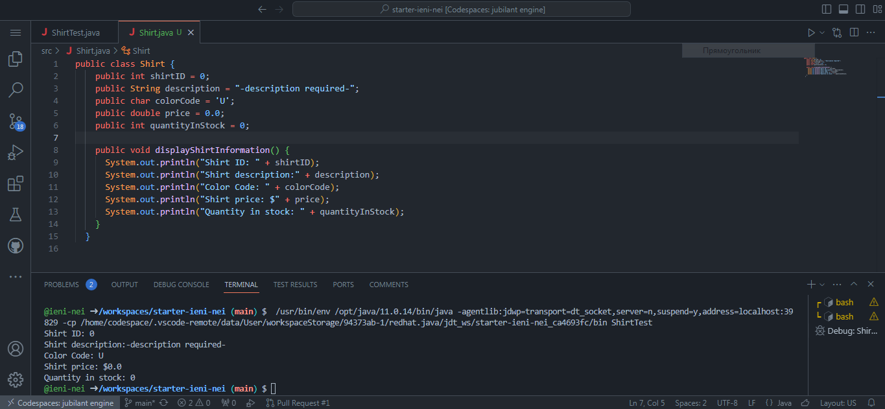
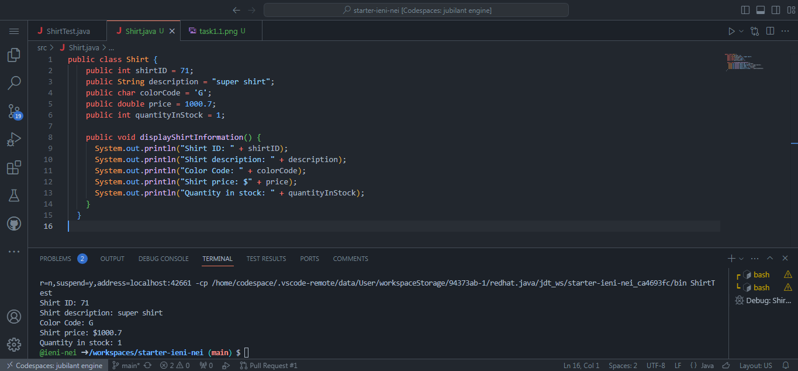

## Завдання 1. Створення та запуск першої програми (сорочки)
Код:

```java
    public class Shirt {
    public int shirtID = 71;
    public String description = "super shirt";
    public char colorCode = 'G';
    public double price = 1000.7;
    public int quantityInStock = 1;
    
    public void displayShirtInformation() {
      System.out.println("Shirt ID: " + shirtID);
      System.out.println("Shirt description: " + description);
      System.out.println("Color Code: " + colorCode);
      System.out.println("Shirt price: $" + price);
      System.out.println("Quantity in stock: " + quantityInStock);
    }
  }
```

Результати:

