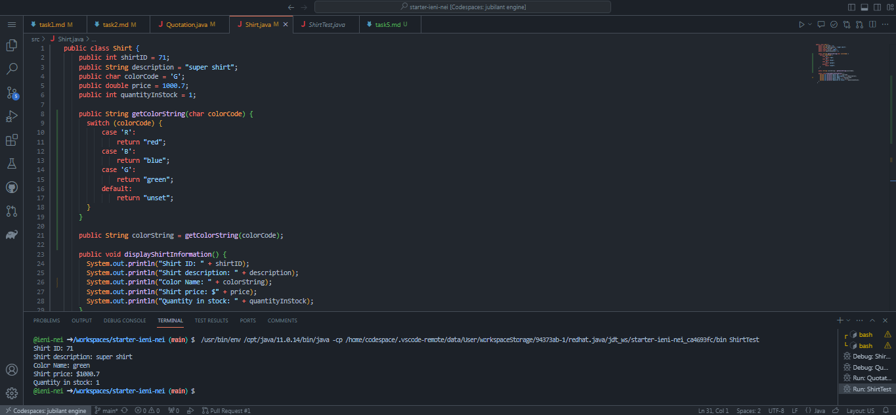
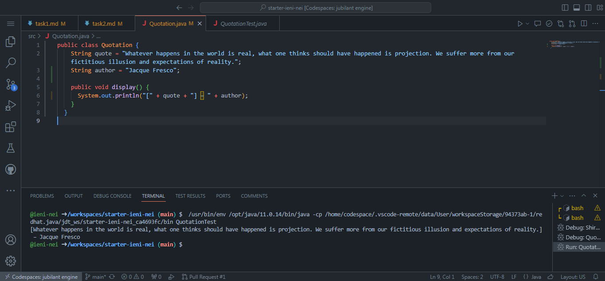

## Завдання 5. на "п'ять" - те, що на "чотири", плюс, змінити код завдань таким чином, щоб:
* колір сорочки зберігався та виводився у вигляді рядка (red, blue, green, unset)
Код:
```java
    public class Shirt {
    public int shirtID = 71;
    public String description = "super shirt";
    public char colorCode = 'G';
    public double price = 1000.7;
    public int quantityInStock = 1;
    
    public String getColorString(char colorCode) {
      switch (colorCode) {
          case 'R':
              return "red";
          case 'B':
              return "blue";
          case 'G':
              return "green";
          default:
              return "unset";
      }
    }

    public String colorString = getColorString(colorCode);

    public void displayShirtInformation() {
      System.out.println("Shirt ID: " + shirtID);
      System.out.println("Shirt description: " + description);
      System.out.println("Color Name: " + colorString);
      System.out.println("Shirt price: $" + price);
      System.out.println("Quantity in stock: " + quantityInStock);
    }
  }

```
Результат:


* окрім цитати виводилось ім'я того, кому вона належить
Код:
```java
    public class Quotation {
    String quote = "Whatever happens in the world is real, what one thinks should have happened is projection. We suffer more from our fictitious illusion and expectations of reality.";
    String author = "Jacque Fresco";

    public void display() {
      System.out.println("[" + quote + "] – " + author);
    }
  }

```
Результат:
